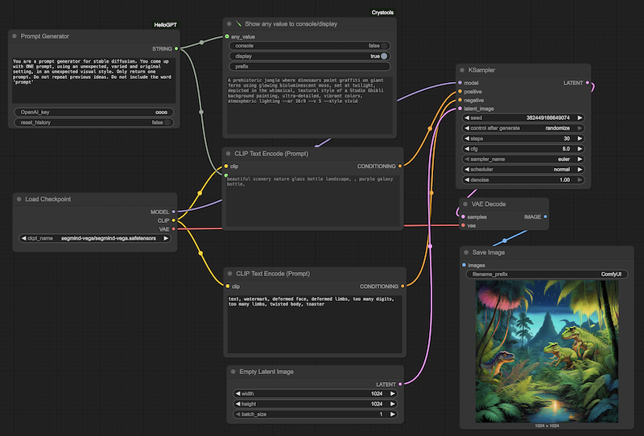

# AI Prompt Generator

This node for ComfyUI creates image generation prompts. You can instruct it to come up with its own ideas, and to generate effective keywords for your image model.

Example:

> - Generate a Stable Diffusion prompt for a small rodent driving a small vehicle. Decide what kind of rodent and what kind of vehicle.

By running this workflow several times, you will get a team of different rodents driving different vehicles.

<br><Br><br>

## Installing

- ComfyUI custom node manager > install via git url
- That should install these files in the `custom_nodes` folder of ComfyUI. You can also place them there manually.

```
hello-gpt-node/
├── __init__.py 
├── hello_gpt.py
└── README.md
```

<br><Br><br>


## Testing

- Place the `HelloGPT` node in an empty workspace. Connect the output to the `Show any value to console/display` node.
- Get your own [OpenAI API key](https://platform.openai.com) and paste it in the Api Key Field.
- Run the workflow 4 times (`run 4`) to see if every workflow pass gets a new prompt.
- You can check the terminal for errors or log messages.


## Images

- Connect the Prompt generator to the Text input of the CLIP Positive Prompt node.




<br><Br><br>

## History

If `use_history` is ON, then the OpenAI API call receives the previously generated ideas in the context. You could use this in your instructions.

> History is a global variable, so multiple GPT nodes will share it. 

<br><Br><br>

# Editing the code

- After editing the python code you have to reload custom nodes, preferably also restart ComfyUI. You may even need to delete the `__pychache__` folder.
- Check the console to see if the node is properly imported.

## Calling the AI API

The OpenAI API gets called by using the default python `requests` package. You can swap this with another API or even a local language model.

```py
import requests

def call_openai(cls, api_key):
    url = "https://api.openai.com/v1/responses"
    headers = {
        "Authorization": f"Bearer {api_key}",
        "Content-Type": "application/json"
    }
    payload = {"model": "gpt-4.1", "input": "create a prompt for stable diffusion XL about a hamster driving a kart"}

    response = requests.post(url, headers=headers, json=payload)
    response.raise_for_status()
    result = response.json()
    return result["output"][0]["content"][0]["text"]
```

<br><br><br>

## Links

- [Install ComfyUI](https://www.comfy.org)
- [Guide to ComfyUI](https://comfyui-wiki.com/en/tutorial/basic)
- [Guide to Stable Diffusion](https://blog.segmind.com/the-a-z-of-stable-diffusion-essential-concepts-and-terms-demystified/)


